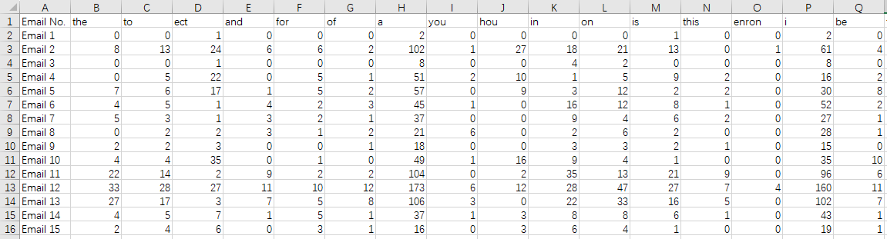
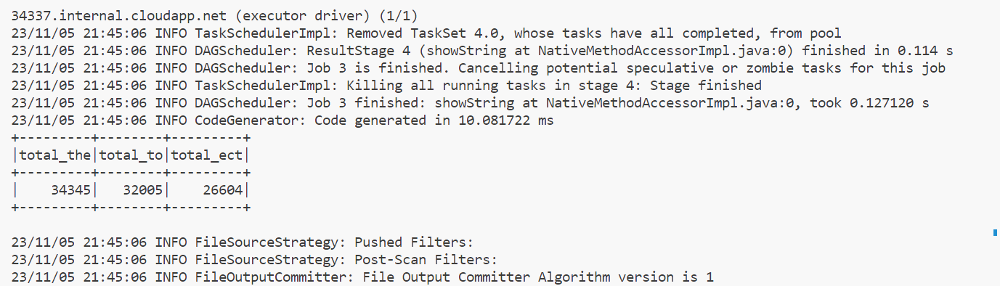

# Email Data Analysis with PySpark

## Overview

This project utilizes PySpark to perform data analysis on a dataset of emails. The script reads a CSV file containing counts of certain words in various emails, performs data transformation, and saves the results into a new CSV file.

## Dataset

The dataset is expected to be in CSV format with a header row and an index column. Each row represents an email, with columns for the counts of specific words within that email.

Example:
```csv
Email No.,the,to,ect,and,for,of,a,you,hou,in,on,is,this
Email 1,0,0,1,0,0,0,2,0,0,0,0,1,0
Email 2,8,13,24,6,6,2,102,1,27,18,21,13,0
...
```


## Requirements

- Apache Spark
- Python 3.8 or higher
- PySpark library

## Setup

1. Ensure Apache Spark is installed and configured on your system.
2. Install PySpark using `pip` if not already installed:
pip install pyspark

## Usage

1. Place your dataset CSV file in the project directory and name it `emails_dataset.csv`.
2. Run the script `email_word_count.py`.
3. The script will create a new CSV file named `transformed_emails_dataset.csv` in the project directory.

## Transformations

The script transforms the dataset by ensuring all word count columns are of integer type.

## Output

The result is a new CSV file with the same data as the input, but with all columns cast to integer type, ensuring numerical consistency for further analysis.


## Stopping the Spark Session

The script ends by stopping the Spark session, releasing the resources allocated for the analysis.